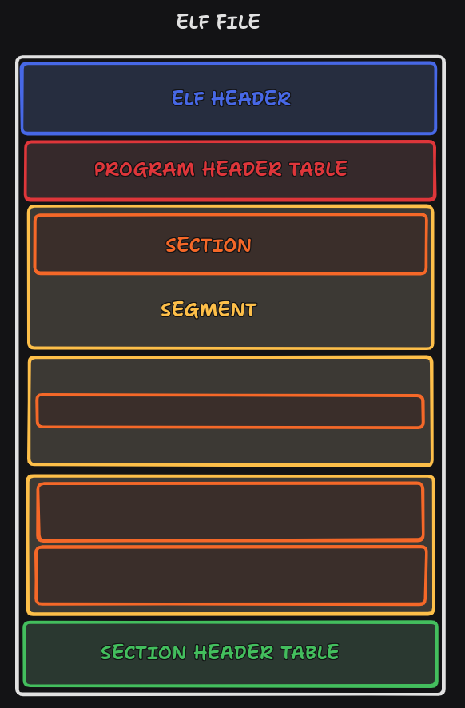

# nm

Implementation of nm command.

## Description

Nm is an Unix projet written in C whose goal is to rewrite the existing nm command. Only ELF (32 and 64 bits) object files, executables and shared objets should be processed.  
This serves as an introduction to ELF file format and how binaries are linked and loaded on Unix systems.

The two major parts of the project involve validating the ELF file and parsing the symbols.  
Regarding validation, it is necessary to ensure that the file is a valid ELF binary, thanks to the various data present in the headers. Additionally, care must be taken never to attempt to access memory space outside the mapped file.  
A simple iteration over structures within the .symtab section allows for parsing symbols and storing them in an allocated array.  

The symbols are then sorted according to the order defined by nm (or at least as close as possible) and printed on the standard output.

The program accepts the following options: `-a` `-g` `-p` `-r` `-u`.

### Basic diagram of an ELF file



## Usage

```
# build the shared library
make

# run the executable
./ft_nm [options] [file...]

# use the shell script
./nm_diff.sh [file...]
```
